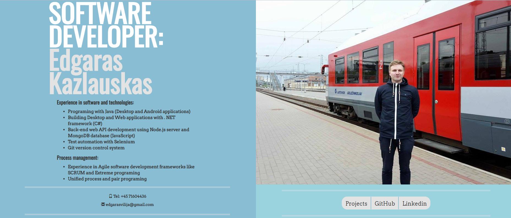
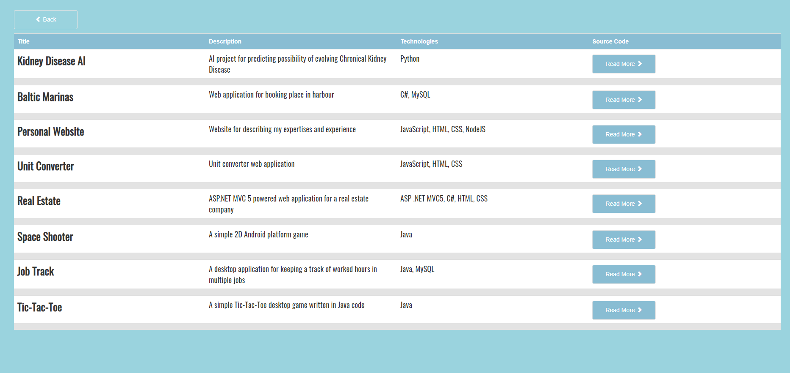
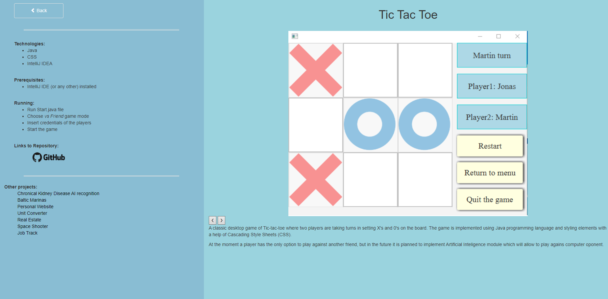

# Personal Website of Edgaras Kazlauskas

Personal website of Edgaras Kazlauskas which goal is to present both the programming skills and projects done.
One the website it is possible to see descriptions of projects that are already done and those that are still being
built.

It is also possible to find the contact information of Edgaras Kazlauskas or to contact him directly via a user frienly fill form.
The website can be viewed on any browser and also on a mobile device. 

This personal website is built on Node.js platform together with Express framework, HTML and CSS. 

Link to the website: http://edgaras-cv.herokuapp.com

## Technologies

+ JavaScript
+ Node.js
+ Express framework
+ HTML
+ CSS
+ Bootstrap

## Getting Started

In order to run the project a small amount of prerequisites and additional steps have to be fulfilled.

### Prerequisites

+ Node.js installed
+ Web browser

### Running

+ Clone the project from GitHub repository
+ Open terminal on the project root directory
+ In terminal run command `node app.js`
+ Go to a browser and access `localhost:3000` address